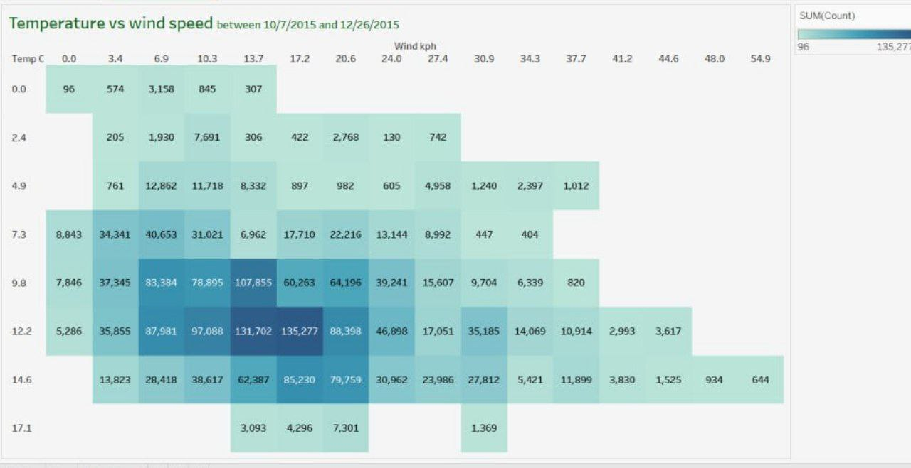

# Portfolio
*Analytics portfolio*

## Project 1: 
### *British Airways Data Analytics Internship Project*
This project was part of my virtual internship with Forage for British Airways. I worked on analyzing customer feedback to find ways to improve the airline’s services and overall customer experience.

### Task 1 : Web Scraping to gain company insights

* **Cleaned the Data**: Processed and cleaned the data to make sure it was ready for analysis (handled missing info, standardized formats, etc.).
* **Analyzed Sentiment**: Used sentiment analysis to figure out what customers were happy or unhappy about.
* **Visualized Trends**: Created clear charts and graphs to highlight key trends in customer feedback.
* **Suggested Improvements**: Based on the analysis, I offered some recommendations on how British Airways could improve their service.

  

### Task 2: Predictive Modeling for Customer Acquisition

* **Data Collection:** Collected customer demographic and booking data.
* **Data Preprocessing**: Cleaned and prepared the data for modeling.
* **Predictive Modeling**: Built models to forecast customer bookings using Logistic Regression, Random Forest, etc.
* **Insights**: Identified customer segments likely to book flights and provided targeted marketing recommendations.

 .png)
 
#### Tools Used:
* *Python (Pandas, Scikit-learn)*
* *Machine Learning algorithms* 
* *Jupyter Notebook* for implementation

## Project 2
### *Quantium- Virtual internship project*
This project was part of my virtual internship with Quantium, where I focused on analyzing customer transaction data to gain insights into purchasing behaviors. My goal was to identify trends and develop strategies that could enhance customer engagement and improve marketing efforts. 

### Task 1: Analyzing Customer Transaction Data to Understand Purchase Behavior

* **Collected Data:** Worked with customer transaction datasets provided by Quantium, which included detailed purchase records over a period of time.
* **Cleaned the Data:** Processed and cleaned the data by addressing missing values, filtering outliers, and ensuring consistency across various product categories and time frames.
* **Analyzed Trends:** Conducted an analysis to identify key purchasing patterns, focusing on product sales, customer segments, and seasonal trends.
* **Visualized Insights:** Created charts and graphs that showcased important insights such as top-selling products, peak purchase times, and customer preferences across different product categories.
* **Suggested Strategies:** Based on the data analysis, I proposed strategic recommendations for improving product offerings, customer targeting, and promotional timing to increase sales and customer satisfaction.
  

### Task 2: Market Basket Analysis to Identify Product Associations

* **Performed Analysis:** Conducted a market basket analysis using association rules to discover relationships between different products.
* **Generated Insights:** Identified strong product associations, such as which items customers are likely to buy together and what products are often part of larger transactions.
* **Visualized Relationships:** Created visual representations like heatmaps and network graphs to clearly highlight product pairings and frequently bought-together items.
* **Suggested Opportunities:** Based on the analysis, I recommended potential cross-selling strategies, such as product bundling and targeted promotions to increase revenue by encouraging customers to purchase complementary items.
  

### Task 3: Customer Segmentation to Enhance Marketing Strategies

* **Developed Presentation:** Created a comprehensive PowerPoint presentation summarizing the key findings and insights from my previous tasks, focusing on customer transaction analysis, market basket analysis, and customer segmentation.

  
#### Tools:

* Python: The primary programming language for data cleaning, analysis, and visualization throughout the project.
* Pandas: Essential for data manipulation, allowing for efficient filtering, grouping, and analysis of large datasets.
* NumPy: Utilized for numerical operations and efficient handling of arrays, especially during data processing tasks.
* Matplotlib & Seaborn: Used to create informative visualizations, such as charts, graphs, and heatmaps, to communicate insights effectively.
* Jupyter Notebook: Served as the development environment for documenting the entire workflow, including code, visualizations, and insights.
* Canva: Utilized for creating visually appealing presentations and infographics to effectively communicate project findings and recommendations.

  
## Project 3 
### *London Bike Rides Analysis - > Tableau project*

For this project, I developed a Tableau dashboard to analyze cycling patterns in London. The dataset includes information on bike ride durations, start and end locations, and times of use. The aim of the project was to identify peak usage periods, popular routes, and general bike traffic trends throughout the city.

I gathered bike ride data for London, focusing on details like trip duration, start and end locations, and the number of riders. Then cleaned and processed the raw data to remove any inaccuracies, ensuring the dataset was ready for analysis. Next step involves analyzing various patterns like peak hours, popular routes, and bike usage across different times of the day and year. Finnaly I created visualizations to present the results clearly and make it easier to understand the bike usage trends in London.

#### Tools I Used
* Python: I used Python to handle the data processing and analysis.
* Libraries: Pandas, NumPy, Matplotlib, and Seaborn for data manipulation and creating visualizations.
* Jupyter Notebook: I worked in Jupyter Notebook to document the analysis and run my code. 

#### Insights from the Analysis

* The majority of bike rides occur during early morning and late afternoon, coinciding with work commute times.
* Bike usage significantly increases during warmer months, particularly in the summer, with a noticeable drop in colder months.
* Several central London stations serve as primary hubs for bike rides, with heavy traffic during the work week.

## Project 4 
### Data Cleaning with SQL

This project involved cleaning a raw dataset of Nashville housing data to prepare it for analysis. The dataset contained various inconsistencies and missing information, which required several data cleaning steps to ensure the data was structured and accurate for further use.

* **Handled Missing Data:** I identified missing entries in key columns, applied strategies to fill in or drop incomplete records where necessary.
* **Corrected Data Types:** Ensured that data types were consistent across the dataset, such as converting numerical data stored as text back into numeric types.
* **Standardized Dates and Formats:** Ensured that date columns and other data formats were consistent throughout the dataset to make future analysis easier.
* **Removed Duplicates:** Found and removed duplicate records that could skew the results of any subsequent analysis.
* **Addressed Outliers:** Identified and addressed potential outliers that could affect the accuracy of analysis.

#### Tools I Used
* SQL: The primary language used to clean the dataset. All data transformation tasks, including handling missing values, removing duplicates, and standardizing formats, were performed with SQL queries.
* PostgreSQL: I used PostgreSQL to store and manipulate the data.
* Jupyter Notebook: For documenting the SQL queries and steps involved in cleaning the data.

## Project 5 
### Housesales Analysis - > Tableau project

Project aimed to visualize key insights such as housing prices, locations, and factors affecting property value. The dataset includes information on house features like square footage, number of bedrooms and bathrooms, year built, and sale price, giving a comprehensive view of the real estate market in King County.

* **Data Cleaning & Preprocessing:** Cleaned and transformed the dataset to ensure the data was ready for visualization. This included handling missing values, normalizing columns, and correcting data types.
* **Dashboard Creation:** I used Tableau to create an interactive dashboard that highlights key housing metrics, enabling users to explore trends in sale prices, house sizes, and location-based insights.
* **Insight Generation:** I analyzed the impact of different features, such as the number of bedrooms, lot size, and proximity to the city center, on house prices to provide data-driven insights into King County's housing market.

#### Tools I Used
* Tableau: The primary tool used for data visualization. Tableau allowed me to build a dynamic, interactive dashboard that presents the insights in a user-friendly format.
* Python (for data prep): I used Python and libraries like Pandas to clean and prepare the dataset before importing it into Tableau.
* Tableau Public: I used Tableau Public to share the project online for others to explore.
